# Networkwalks-B082-Week3-Password-Cracking-project


#Task 1 🔐 John the Ripper – PDF Password Recovery Using Johnny GUI

## 📌 Project Overview

This project demonstrates an authorized PDF password-recovery lab on Windows using John the Ripper (Jumbo) through its graphical interface, Johnny.

The objective is to understand how password-protected PDF files can be tested for password recovery using an extracted PDF hash and the Johnny GUI.

For this project, an online PDF hash extraction tool was used to convert the password-protected PDF into a hash that could be processed by John the Ripper.

---

## 🛠️ Tools Used

| Tool | Purpose |
|---|---|
| Windows | Operating system for the lab |
| John the Ripper Jumbo | Password-recovery engine |
| Johnny | GUI front-end for John the Ripper |
| Online PDF Hash Extractor | Converts protected PDF into a crackable hash |
| Password-protected PDF | Lab target file |

---

## 🔄 Project Workflow

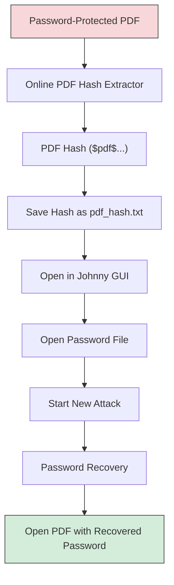

---

## 📄 Step 1 – Prepare the PDF

The laboratory file used for this project was:


My Locked PDF1.pdf|[My-Locked-PDF1.pdf](https://github.com/user-attachments/files/31525342/My-Locked-PDF1.pdf)

The PDF was password-protected so that the password-recovery process could be demonstrated in an authorized environment.

---

## 🌐 Step 2 – Extract the PDF Hash

Instead of extracting the hash through the command line, an online PDF hash extraction tool was used.

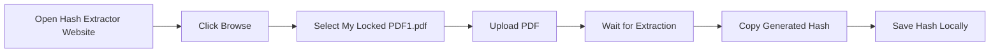

The extracted hash begins with a PDF-related identifier similar to:

```
$pdf$...
```

The complete hash is unique to the protected PDF.

---

## 💾 Step 3 – Save the Extracted Hash

Create a text file named:

```
pdf_hash.txt
```

The extracted PDF hash is stored inside this file.

Example (illustrative only):

```
$pdf$4*4*128*...
```


---

## 🪟 Step 4 – Open Johnny GUI

After installing John the Ripper Jumbo, open the Johnny graphical interface.

Johnny provides a graphical interface for controlling John the Ripper without requiring the user to perform the main password-recovery process through Command Prompt.

**Johnny Configuration**

Open the Johnny settings and configure the John the Ripper executable if required. The executable is located inside the John the Ripper installation directory.

Example path:

```
C:\JTR\john-1.9.0-jumbo-1-win64\run\john.exe
```

Johnny should then recognize the John the Ripper installation.

---

## 🔑 Step 5 – Load the PDF Hash in Johnny

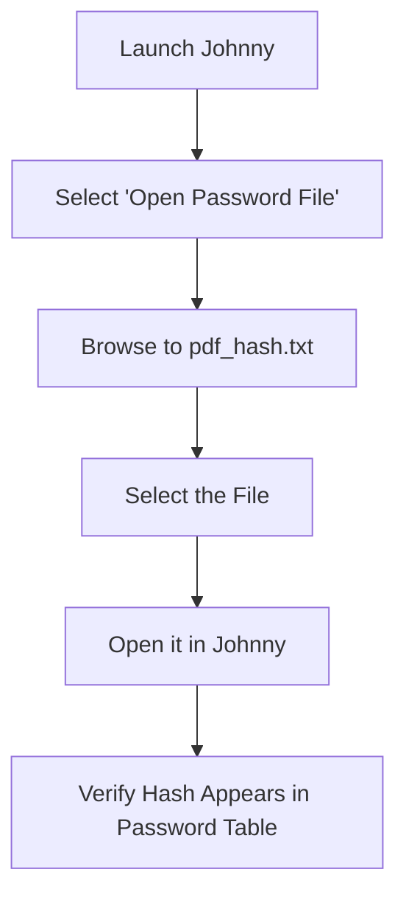

The loaded entry should be recognized as a PDF-related hash format.

---

## 🚀 Step 6 – Start the Password-Recovery Attack

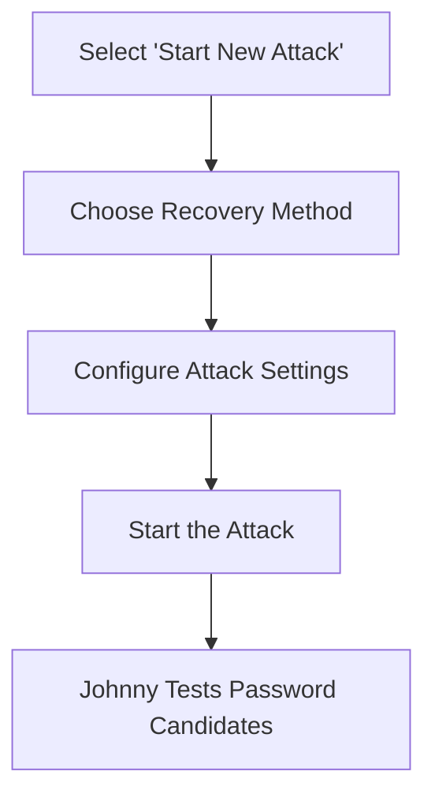

Recovery time depends on several factors:

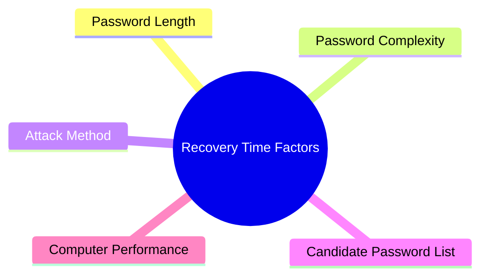

---

## ✅ Step 7 – Check the Recovered Password

After the password is successfully recovered, Johnny displays the recovered password in its interface.

The recovered password can then be used to open:

```
My Locked PDF1.pdf
```

This confirms that the password-recovery process was successful.

---

## 🖼️ Evidence From the Lab

The following screenshots can be included as evidence for the project.

| # | Description | Suggested Filename |
|---|---|---|
| 1 | PDF being selected in the online hash extraction tool | `
` |
| 2 | Generated PDF hash shown in the extraction tool | `
` |
| 3 | Johnny running and configured with John the Ripper | `
` |
| 4 | `pdf_hash.txt` loaded into Johnny's password table | `
` |
| 5 | Start New Attack configuration in Johnny and Johnny displaying the successfully recovered password |`
` |
| 6 | Recovered password successfully opening the PDF | https://github.com/user-attachments/assets/ddf66d81-99e7-47fa-830c-bc7acc82e0eb


---


---

## 🔍 How the Process Works

John the Ripper does not directly need the original PDF contents during the password-testing stage.

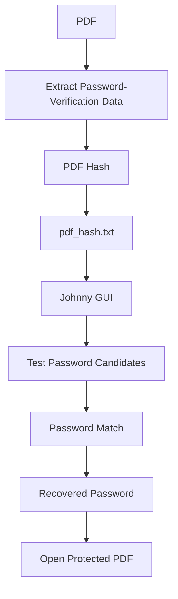

The extracted hash contains information that allows John the Ripper to verify password candidates against the protected PDF.

---


# 🔹 TASK 2 – PDF Password Recovery (NetworkWalks Tools)

## 🎯 Objective

Task 2 demonstrates PDF password recovery using the **NetworkWalks online tools** instead of John the Ripper / Johnny.

The task consists of two main stages:

1. Extract the PDF hash using the **NetworkWalks Hash Calculator**
2. Perform a dictionary attack using the **NetworkWalks Password Cracker**

---

## 🛠️ Task 2 – Tools Used

- NetworkWalks Project Task Lab
- NetworkWalks Hash Calculator
- NetworkWalks Password Cracker
- Password-protected PDF
- Built-in dictionary / wordlist

---

## 🔄 Task 2 Workflow

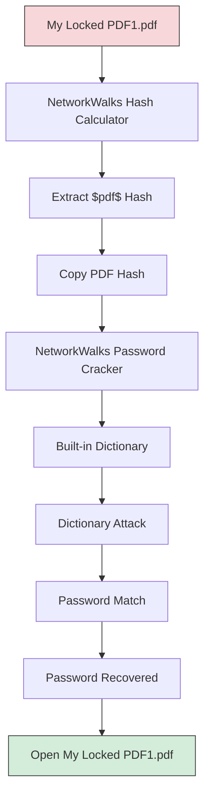

---

## 🌐 Task 2 – Step 1: NetworkWalks Project Task

The NetworkWalks project page provides the laboratory material for the password-cracking exercise, including the downloadable protected PDF `My Locked PDF1`.


---

## 🔑 Task 2 – Step 2: Open Hash Calculator

The **NetworkWalks Hash Calculator** contains different sections, including Text, File, and PDF. The **PDF** section is used for the password-protected PDF.

![NetworkWalks Hash Calculator]


---

## 📄 Task 2 – Step 3: Select the PDF

The protected PDF `My Locked PDF1.pdf` is selected in the PDF section of the Hash Calculator. The tool processes the PDF and extracts a crackable PDF hash.

---

## 🔐 Task 2 – Step 4: Extract the PDF Hash

After processing the PDF, the Hash Calculator displays a PDF hash beginning with `$pdf$...`. The calculator provides options to copy or download the extracted hash.


---

## 🔄 Task 2 – Step 5: Open NetworkWalks Password Cracker

The next stage uses the **NetworkWalks Password Cracker**, a separate tool designed for a **dictionary attack**, where password candidates from a wordlist are tested against the PDF hash.


---

## 📋 Task 2 – Step 6: Enter the PDF Hash

The extracted `$pdf$` hash from the Hash Calculator is copied and entered into the `PDF HASH ($PDF$...)` field of the NetworkWalks Password Cracker.


---

## 📚 Task 2 – Step 7: Select the Dictionary

The NetworkWalks Password Cracker provides a built-in password list — `Built-in list (100 passwords)`. The active wordlist is used for the dictionary attack.

---

## 🚀 Task 2 – Step 8: Run the Dictionary Attack

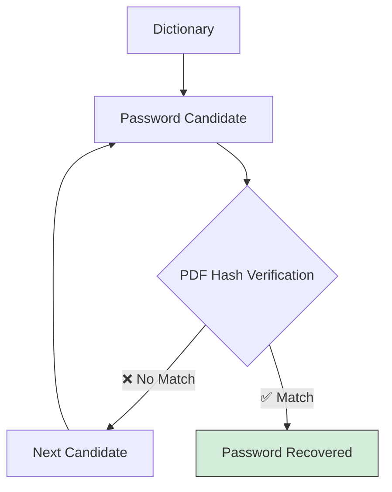

---

## ✅ Task 2 – Step 9: Password Recovered

The NetworkWalks Password Cracker reports a successful password recovery.


---

## 📄 Task 2 – Step 10: Open the PDF

The recovered password can then be used to open `My Locked PDF1.pdf`. If the password is correct, the protected PDF can be unlocked.


---

# 🔹 TASK 3 – Authorized Web Portal Security Testing

## 🎯 Objective

Task 3 documents an authorized security-testing exercise performed against:

```
medirozahospital.com
```

The task uses Burp Suite for authentication security testing. After successful login during the authorized project exercise, three password-protected PDF reports were available inside the portal.

The PDF password-protection portion was then tested using the NetworkWalks Hash Calculator and NetworkWalks Password Cracker.


---

## 🛠️ Task 3 – Tools Used

| Tool | Purpose |
|---|---|
| Burp Suite | Authentication security testing |
| medirozahospital.com | Authorized target portal |
| NetworkWalks Hash Calculator | Extracts PDF password-verification hash |
| NetworkWalks Password Cracker | Dictionary attack against extracted hash |
| Password-protected PDF reports | Test artifacts retrieved after login |

---

## 🔄 Task 3 Workflow

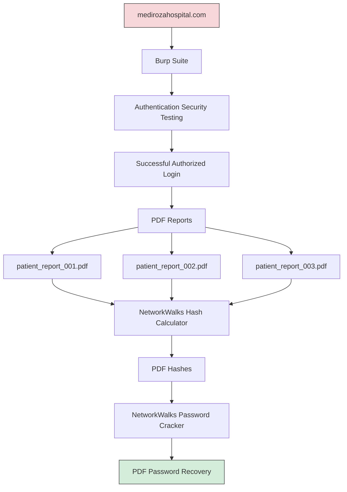

---

## 🌐 Step 1 – Access the Portal

The portal was accessed as part of the authorized security-testing exercise. Burp Suite was used to observe the authentication workflow.

---

## 🧪 Step 2 – Authentication Testing with Burp Suite

Burp Suite was used during the authorized assessment to observe and test the authentication workflow. The testing resulted in a successful login within the project environment.

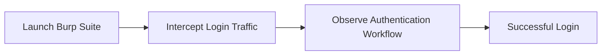

---

## 📂 Step 3 – PDF Reports

After successful authorized access, the following password-protected PDF reports were available:

| Report File |
|---|
| patient_report_001.pdf |(https://github.com/user-attachments/files/31525295/patient_report_003.pdf)
| patient_report_002.pdf |(https://github.com/user-attachments/files/31525285/patient_report_002.pdf)
| patient_report_003.pdf |(https://github.com/user-attachments/files/31525283/patient_report_001.pdf)

These files are documented as project/test artifacts.


---

## 🔑 Step 4 – Extract PDF Hashes

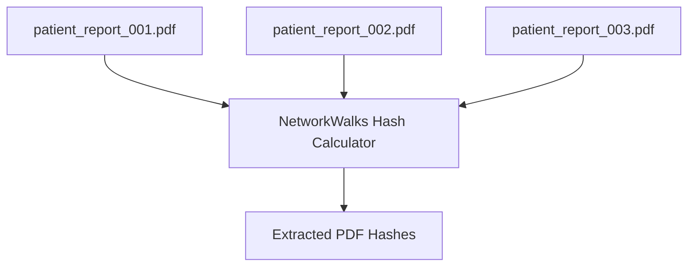

The password-protected PDF reports were processed using the NetworkWalks Hash Calculator. The purpose of this step was to extract the PDF password-verification data required for password auditing. The extracted hashes were then used with the NetworkWalks Password Cracker.

---

## 🔐 Step 5 – Test PDF Password Protection

The extracted PDF hashes were supplied to the NetworkWalks Password Cracker for dictionary-based password testing.

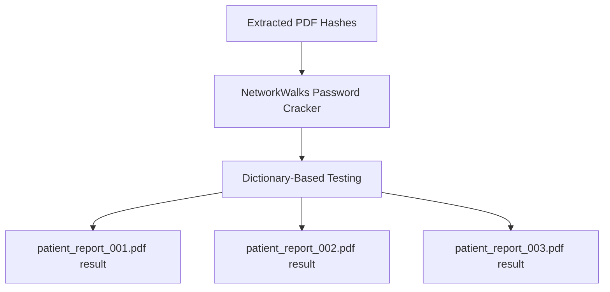

The three test artifacts were:

- `[patient_report_001.pdf]`
- `patient_report_002.pdf`
- `patient_report_003.pdf `

The complete activity is documented in:


## videos/task3-complete-demo.mp4

[https://github.com/user-attachments/asset](https://github.com/user-attachments/assets/d08daf17-eccd-4f47-b49e-c80710d39758)

---

## ✅ Step 6 – Results
The results of the authorized exercise are demonstrated in the complete Task 3 video.
