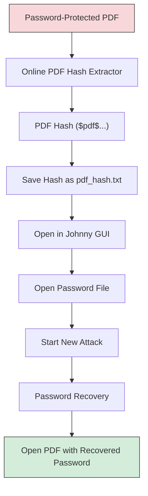
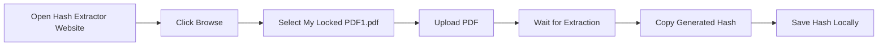
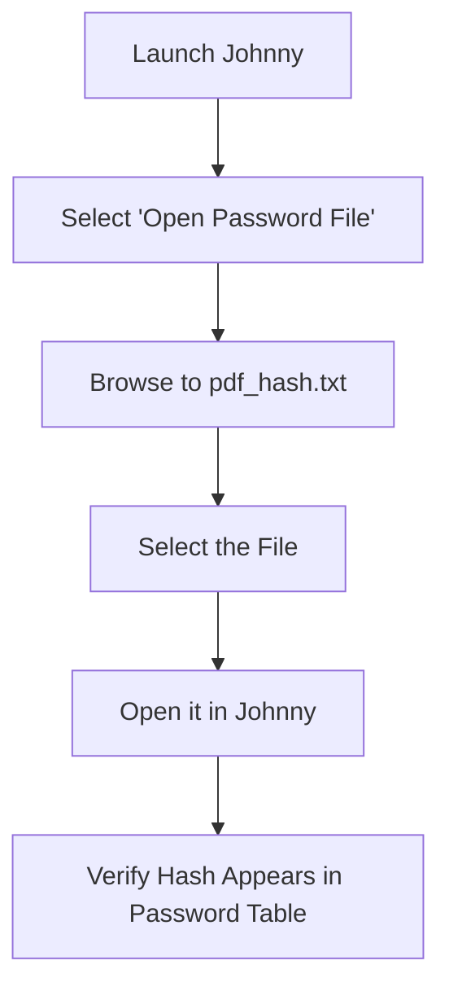
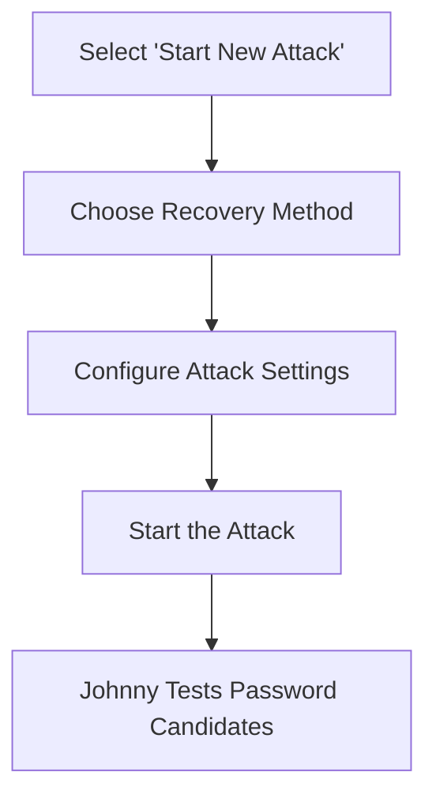
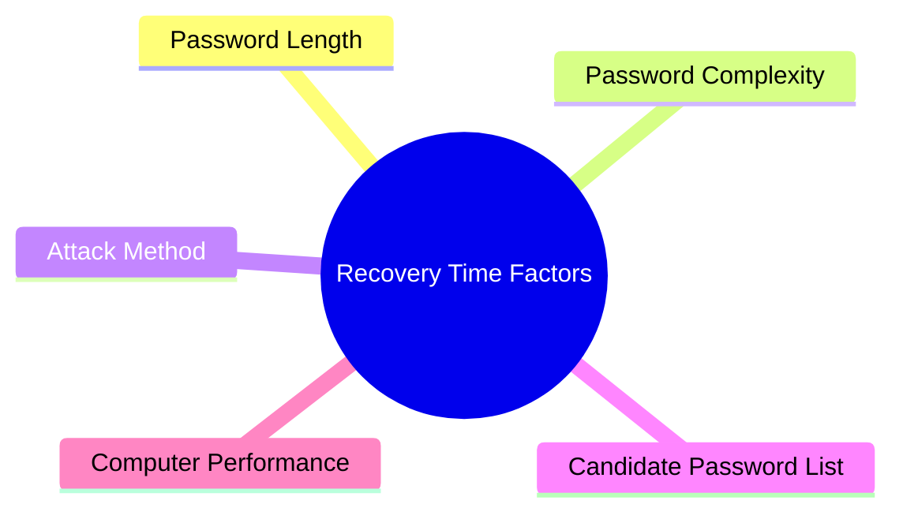
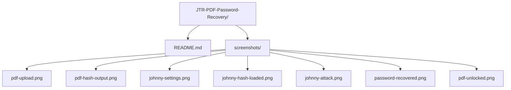
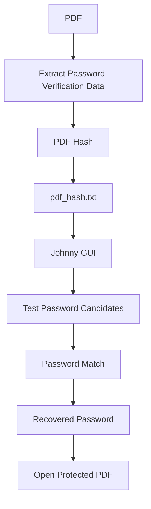
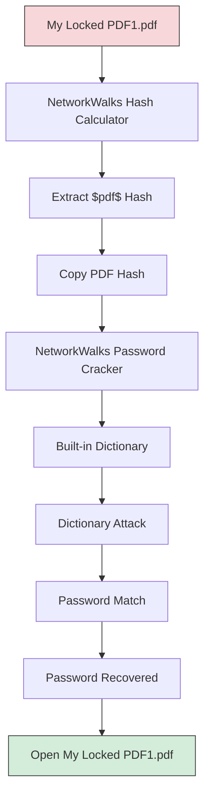
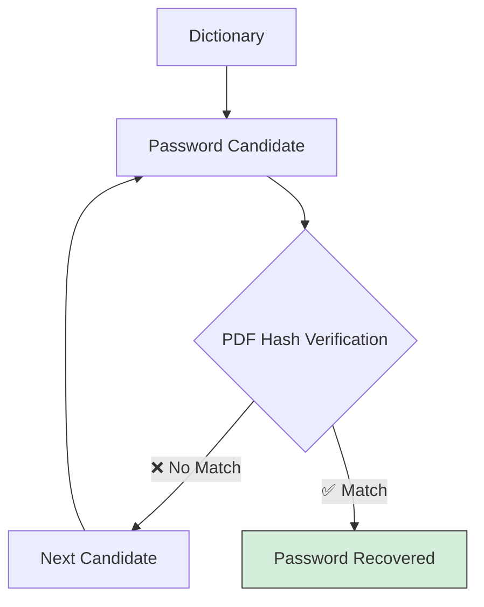

# 🔐 John the Ripper – PDF Password Recovery Using Johnny GUI

## 📌 Project Overview

This project demonstrates an authorized PDF password-recovery lab on Windows using John the Ripper (Jumbo) through its graphical interface, Johnny.

The objective is to understand how password-protected PDF files can be tested for password recovery using an extracted PDF hash and the Johnny GUI.

For this project, an online PDF hash extraction tool was used to convert the password-protected PDF into a hash that could be processed by John the Ripper.

---

## 🛠️ Tools Used

| Tool | Purpose |
|---|---|
| Windows | Operating system for the lab |
| John the Ripper Jumbo | Password-recovery engine |
| Johnny | GUI front-end for John the Ripper |
| Online PDF Hash Extractor | Converts protected PDF into a crackable hash |
| Password-protected PDF | Lab target file |

---

## 🔄 Project Workflow



---

## 📄 Step 1 – Prepare the PDF

The laboratory file used for this project was:

```
My Locked PDF1.pdf
```

The PDF was password-protected so that the password-recovery process could be demonstrated in an authorized environment.

---

## 🌐 Step 2 – Extract the PDF Hash

Instead of extracting the hash through the command line, an online PDF hash extraction tool was used.



The extracted hash begins with a PDF-related identifier similar to:

```
$pdf$...
```

The complete hash is unique to the protected PDF.

---

## 💾 Step 3 – Save the Extracted Hash

Create a text file named:

```
pdf_hash.txt
```

The extracted PDF hash is stored inside this file.

Example (illustrative only):

```
$pdf$4*4*128*...
```

> ⚠️ The actual hash should not be published in a public repository.

---

## 🪟 Step 4 – Open Johnny GUI

After installing John the Ripper Jumbo, open the Johnny graphical interface.

Johnny provides a graphical interface for controlling John the Ripper without requiring the user to perform the main password-recovery process through Command Prompt.

**Johnny Configuration**

Open the Johnny settings and configure the John the Ripper executable if required. The executable is located inside the John the Ripper installation directory.

Example path:

```
C:\JTR\john-1.9.0-jumbo-1-win64\run\john.exe
```

Johnny should then recognize the John the Ripper installation.

---

## 🔑 Step 5 – Load the PDF Hash in Johnny



The loaded entry should be recognized as a PDF-related hash format.

---

## 🚀 Step 6 – Start the Password-Recovery Attack



Recovery time depends on several factors:



---

## ✅ Step 7 – Check the Recovered Password

After the password is successfully recovered, Johnny displays the recovered password in its interface.

The recovered password can then be used to open:

```
My Locked PDF1.pdf
```

This confirms that the password-recovery process was successful.

---

## 🖼️ Evidence From the Lab

The following screenshots can be included as evidence for the project.

| # | Description | Suggested Filename |
|---|---|---|
| 1 | PDF being selected in the online hash extraction tool | `pdf-upload.png` |
| 2 | Generated PDF hash shown in the extraction tool | `pdf-hash-output.png` |
| 3 | Johnny running and configured with John the Ripper | `johnny-settings.png` |
| 4 | `pdf_hash.txt` loaded into Johnny's password table | `johnny-hash-loaded.png` |
| 5 | Start New Attack configuration in Johnny | `johnny-attack.png` |
| 6 | Johnny displaying the successfully recovered password | `password-recovered.png` |
| 7 | Recovered password successfully opening the PDF | `pdf-unlocked.png` |

---

## 📁 Suggested GitHub Structure



---

## 🚫 Files That Should Not Be Uploaded

Do not upload sensitive laboratory files such as:

- `pdf_hash.txt`
- `My Locked PDF1.pdf`
- `rockyou.txt`
- `recovered-password.txt`

unless you are certain that they contain no sensitive information.

For a public GitHub repository, redact:

- Actual PDF password
- Complete PDF hash
- Sensitive document contents
- Personal information

---

## 🔍 How the Process Works

John the Ripper does not directly need the original PDF contents during the password-testing stage.



The extracted hash contains information that allows John the Ripper to verify password candidates against the protected PDF.

---

## 🔐 Security & Privacy

This project is intended for:

- Cybersecurity education
- CTF and laboratory environments
- Password-auditing practice
- Recovery of personally owned files
- Authorized security testing

> ⚠️ Do not use this technique against someone else's protected files without authorization.

**Online Hash Extraction Warning**

Because an online service was used during this laboratory exercise, confidential PDFs should not be uploaded to such services.

Examples of documents that should not be uploaded include:

- Identity documents
- Bank statements
- Private certificates
- Company documents
- Confidential reports

For sensitive documents, a trusted local extraction process is preferable.

---

## 🎯 Learning Outcomes

Through this project, I learned:

- What PDF password hashes are
- How PDF hash extraction works
- How John the Ripper processes password hashes
- How to use the Johnny graphical interface
- How to load a password hash into Johnny
- How to configure and start a password-recovery attack
- How password complexity affects recovery time
- Why recovered passwords and password hashes should not be publicly disclosed
- The importance of authorization when performing password auditing

---

# 🔹 TASK 2 – PDF Password Recovery (NetworkWalks Tools)

## 🎯 Objective

Task 2 demonstrates PDF password recovery using the **NetworkWalks online tools** instead of John the Ripper / Johnny.

The task consists of two main stages:

1. Extract the PDF hash using the **NetworkWalks Hash Calculator**
2. Perform a dictionary attack using the **NetworkWalks Password Cracker**

---

## 🛠️ Task 2 – Tools Used

- NetworkWalks Project Task Lab
- NetworkWalks Hash Calculator
- NetworkWalks Password Cracker
- Password-protected PDF
- Built-in dictionary / wordlist

---

## 🔄 Task 2 Workflow



---

## 🌐 Task 2 – Step 1: NetworkWalks Project Task

The NetworkWalks project page provides the laboratory material for the password-cracking exercise, including the downloadable protected PDF `My Locked PDF1`.


---

## 🔑 Task 2 – Step 2: Open Hash Calculator

The **NetworkWalks Hash Calculator** contains different sections, including Text, File, and PDF. The **PDF** section is used for the password-protected PDF.


---

## 📄 Task 2 – Step 3: Select the PDF

The protected PDF `My Locked PDF1.pdf` is selected in the PDF section of the Hash Calculator. The tool processes the PDF and extracts a crackable PDF hash.

---

## 🔐 Task 2 – Step 4: Extract the PDF Hash

After processing the PDF, the Hash Calculator displays a PDF hash beginning with `$pdf$...`. The calculator provides options to copy or download the extracted hash.


> 🔒 For a public GitHub repository, redact the complete hash before publishing the screenshot.

---

## 🔄 Task 2 – Step 5: Open NetworkWalks Password Cracker

The next stage uses the **NetworkWalks Password Cracker**, a separate tool designed for a **dictionary attack**, where password candidates from a wordlist are tested against the PDF hash.


---

## 📋 Task 2 – Step 6: Enter the PDF Hash

The extracted `$pdf$` hash from the Hash Calculator is copied and entered into the `PDF HASH ($PDF$...)` field of the NetworkWalks Password Cracker.


---

## 📚 Task 2 – Step 7: Select the Dictionary

The NetworkWalks Password Cracker provides a built-in password list — `Built-in list (100 passwords)`. The active wordlist is used for the dictionary attack.

---

## 🚀 Task 2 – Step 8: Run the Dictionary Attack



---

## ✅ Task 2 – Step 9: Password Recovered

The NetworkWalks Password Cracker reports a successful password recovery.


> 🔒 If publishing the repository publicly, redact the password from the screenshot.

---

## 📄 Task 2 – Step 10: Open the PDF

The recovered password can then be used to open `My Locked PDF1.pdf`. If the password is correct, the protected PDF can be unlocked.
